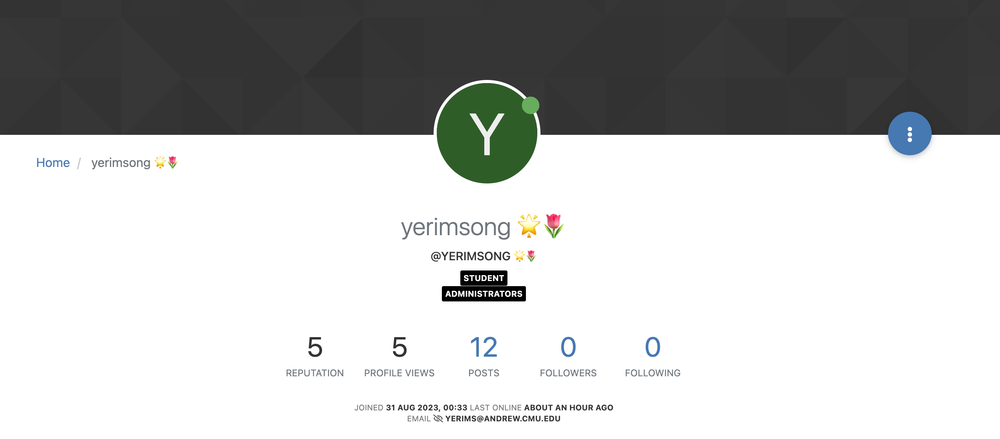
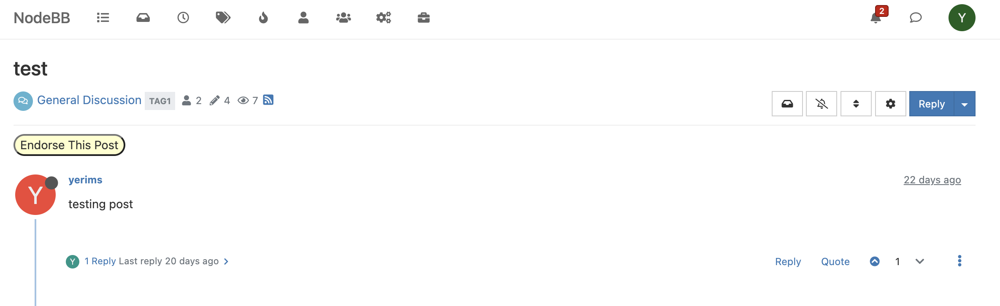

# User Guide

This guide will outline the new features that our team added to NodeBB.

DELETE THIS LATER. JUST INSTRUCTIONS.
"In this file, provide a detailed outline of how to use and user test your new feature(s)
You should also provide a link/description of where your added automated tests can be found, along with a description of what is being tested and why you believe the tests are sufficient for covering the changes that you have made"

## Feature 1: Badges

### Overview

The badges feature adds an icon next to the username based on a user's reputation score and post count. These badges are appended to the username, meaning that the badges will be propagated everywhere on the site including on profile, post comments, and more.

### User Test

A user can test these changes by going to their profile. They can either increase their reputation score by getting upvotes from other users or increase their post count, and in turn they will see their badges change. Specifically, for reputation score, if it less than 5 the badge will be ⭐, less than 20 will be 🌟, and any score above 20 will be 💫. For the post count, if it less than 5 the badge will be 🌱, less than 20 will be 🌷, and any score above 20 will be 🌳.

### Automated Tests

## Feature 2: Endorse Post

### Overview

This feature allows users, both administrators and students, to "endorse" and "unendorse" a post. Once a user has endosred a certain post, it also shows this result to other users.

### User Test

A user can test these changes by going to any post. Above all the replies in a post, there will be a pale yellow button that says "Endorse This Post". When a user clicks on this, text will appear saying that "This post has been endorsed". If the post has already been endorsed, the button will display "Unendorse This Post", and once clicked, the text message will disappear.

### Automated Tests
